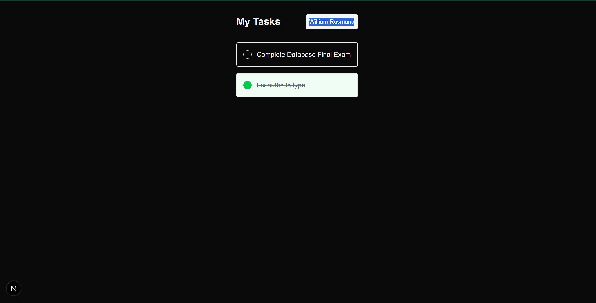

# 📝 TaskMaster - Next.js Todo App

A full-stack Todo application built with **Next.js**, **Prisma**, and **NextAuth.js**. 
This project was developed as part of my portfolio at **BINUS University**.

## 🚀 Preview

## ✨ Features
- **Modern UI**: Styled with Tailwind CSS and Lucide-React icons.
- **Secure Auth**: Integrated with Google OAuth via NextAuth.js.
- **Persistence**: Powered by Prisma ORM with a relational database.
- **Responsive**: Fully optimized for mobile and desktop viewing.

## 🛠️ Tech Stack
- **Framework**: Next.js (App Router)
- **Database**: PostgreSQL / MongoDB (Prisma)
- **Authentication**: Auth.js (v5)
- **Styling**: Tailwind CSS
